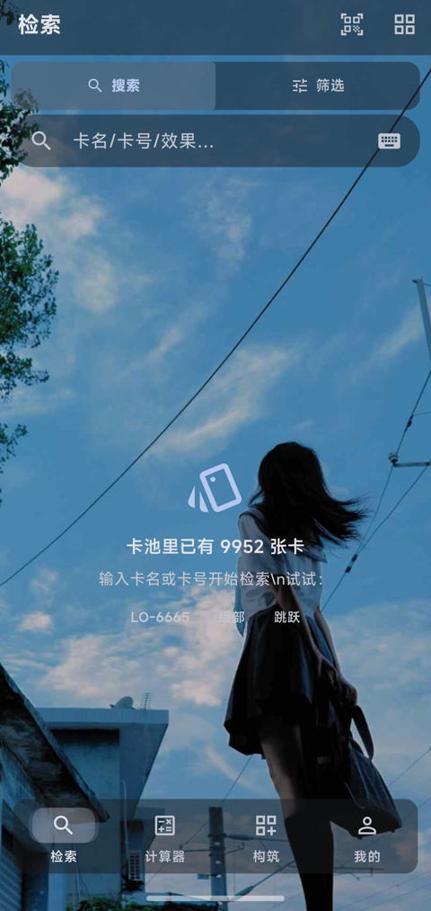
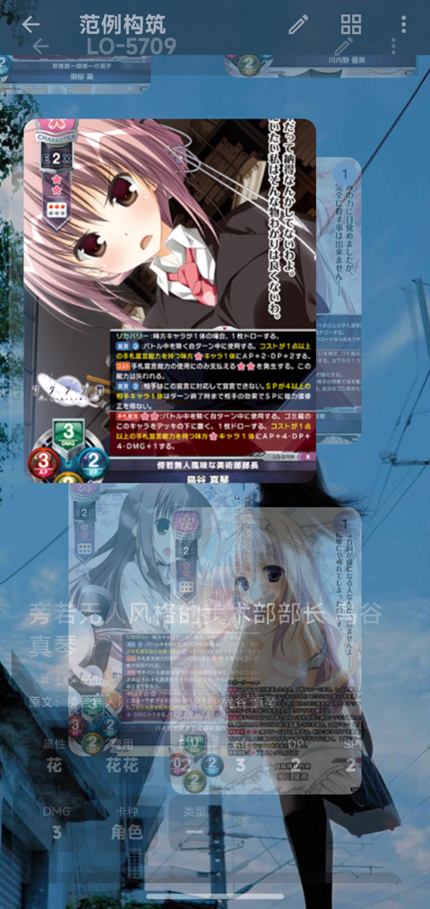
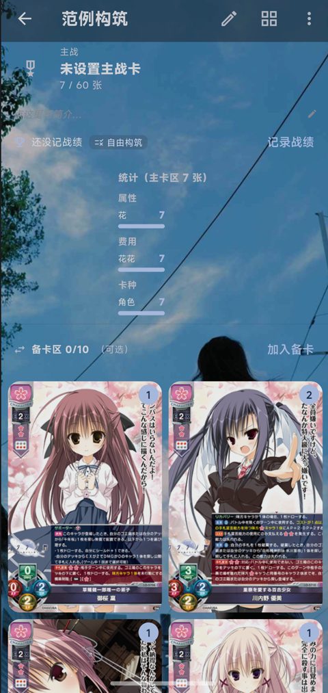
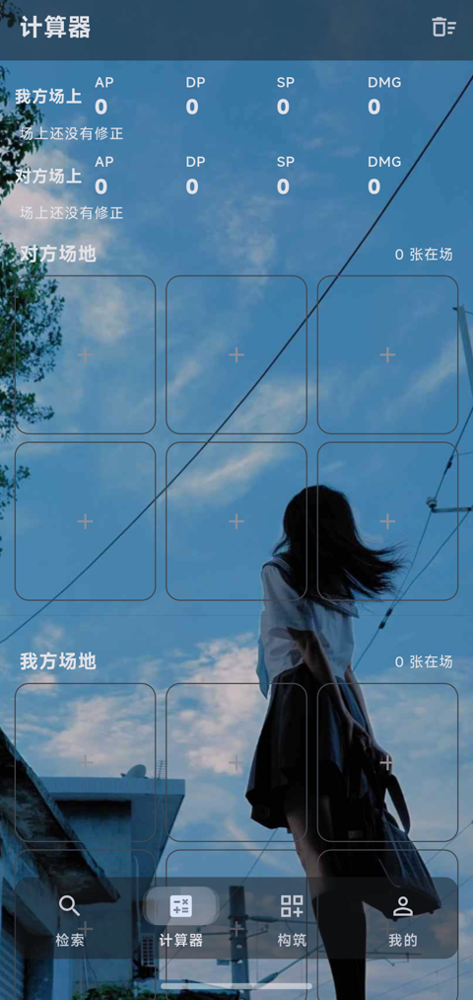
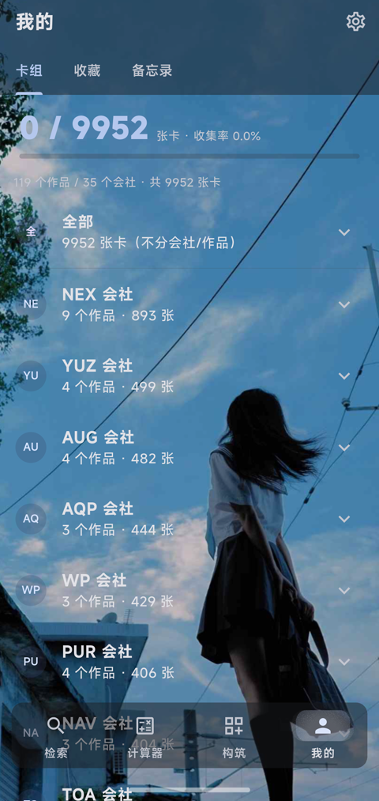

<div align="center">

# lycard

**LYCEE OVERTURE デッキアシスタント**

オフライン優先のカードデータベース · カード画像 · 中国語翻訳 · デッキ構築 · 対戦中の数値計算

[中文](README.md) ｜ [English](README.en.md) ｜ [**日本語**](README.ja.md)

[APK ダウンロード](https://github.com/Lanactnum/lycard-updates/releases) · [機能一覧](FEATURES.ja.md) · [更新履歴](CHANGELOG.md) · [カード画像データパック](../../releases/tag/cards-pack-v1)

</div>

---

## これは何か

`lycard` は **LYCEE OVERTURE** のプレイヤー向けの Android（arm64）ツールです。

データはすべて端末内にあるので、**ネットがなくてもカードを調べ、デッキを組み、計算できます**。
カード画像は二層構成です。APK には圧縮した WebP を同梱し（見る分には十分）、
公式の 372×520 PNG 原寸画像は別途データパックとして配布します —— だからインストーラが
数 GB に膨らみません。

> 非公式のファンメイドです。カードの数値・効果テキスト・カード画像の権利は
> LYCEE OVERTURE 公式および各作品の権利者に帰属します。本プロジェクトは個人のコレクションと
> 対戦中の参照を目的としたもので、商用利用はできません。詳しくは[ライセンス](#ライセンス)へ。


## 截图

<p align="center">
  
</p>

| 検索結果 | カード詳細 | デッキ概要 |
|:---:|:---:|:---:|
|  |  |  |
| **デッキのカード** | **計算機** | **マイ** |
|  |  |  |

## 機能

> 画面ごとの詳細を含む完全なリストは [**機能一覧**](FEATURES.ja.md) にあります。以下は概要です。

### 検索

- **カード名 / カード番号 / 効果テキスト**で検索。中国語名でも引けます（中国語検索インデックス同梱）
- 属性（日 / 月 / 花 / 雪 / 星 / 宙）、コスト、EX、カード種別、シリーズ、レアリティなどで絞り込み
- カード詳細：画像、数値、効果原文＋中国語訳。効果テキスト中の**カード名はタップで
  そのカードへジャンプ**
- 画像は四段フォールバック：**データパックの原寸 → APK 同梱画像 → 公式サイト → プレースホルダ**。
  どこが欠けても落ちません
- カード画像をまとめてギャラリーに保存

### デッキ構築

- メインデッキ 60 枚、同一番号は最大 4 枚、リーダーは最大 1 枚。**限定戦**では
  自動で 30 枚 / 同一番号 2 枚まで / サイドデッキ不可に切り替わります
- デッキフォルダは **カードの所属シリーズ**（作品 / ゲーム / 会社）で分類（LO 番号順ではない）
- 初手シミュレーション、デッキ統計グラフ（属性 / コスト / カード種別の比率）
- デッキ読み込み：公式デッキコードとよくある共有テキストの**二系統の認識**。
  片方が読み取れなければ、もう片方に手動で切り替えられます
- デッキ書き出し：QR コード共有、テキスト共有
- デッキリストの印刷（PDF）

### 計算機

対戦中にカードを場に並べて、その場で数値を計算します。

- **カードを置いた瞬間に自動計算**：`[常時]` やタグなしの「場に出ているだけで効く」効果は
  すぐ数値に反映されます。`[誘発]` / `[宣言]` のような**使って初めて効く**効果は勝手に
  推測せず、カードのパネルから一括または個別に適用します
- **場が変わるたびに全体を再計算**：「味方キャラ全てにＡＰ＋１」のような全体効果は、
  **後から出したカードにも及びます**。効果元のカードを外せば、その分は他のカードから消えます
- **各ステップを確認・変更・削除できる**：各補正には出所（手動 / 効果 / 自動）と
  タイミング（前のターン / このターン / 対応 / 常時）が付き、数値はその場で直せます
- 各カードの下に**チャージ**枚数と**置き場**の枚数 —— 実際のカードと同じようにカードの下に付きます
- 盤面は**保存されません**（画面を離れると消えます）

### その他

- 対戦ルールの早見、禁止・制限カードリスト（オンライン更新可）
- 用語・効果断片の早見
- カメラスキャン：カードの文字や QR コードを読み取ってそのカードへ直行
- UI 多言語（简体中文 / 繁體中文 / English / 日本語 / 한국어 / Русский）
- データのホット更新：カードリスト・翻訳・禁止リストなどをオンラインで差分更新、
  またはファイルマネージャからデータパックを取り込み
- ローカルバックアップ / 復元（zip）、印刷、フィードバック送信

## ダウンロードとインストール

配布は **arm64 のみ**です（現在のスマートフォンはほぼすべて arm64）。

**APK は更新リポジトリにあります**：[`Lanactnum/lycard-updates` → Releases](https://github.com/Lanactnum/lycard-updates/releases)
—— アプリの「更新を確認」もここを見ています。本リポジトリの Releases は**カード画像データパック**のみです。

| ファイル | サイズ | 説明 |
|---|---|---|
| `lycard-<バージョン>-arm64.apk` | **573.5 MB** | **arm64 版**。最も小さく、現在のスマートフォンはほぼすべてこれ |
| `lycard-<バージョン>-universal.apk` | **616.1 MB** | **全アーキテクチャ版**（arm64 + 32bit ARM + x86_64）。古い端末や、相手の機種が不明なとき |
| `lycard-<バージョン>*.sha256` | | それぞれのチェックサム |

> アプリ内の「更新を確認」は**端末のアーキテクチャで自動的に選びます**：arm64 端末には arm64 版、それ以外には全アーキテクチャ版。
> 添付ファイル名の `arm64` / `universal` は意味を持つので、改名しないでください。

インストール後、**一度起動してください**（アプリが自分のデータフォルダを作ります）。

## カード画像データパック

APK に入っているのは**圧縮された**カード画像です。公式の **372×520 PNG 原寸画像**が欲しい場合は、
本リポジトリの Release [**cards-pack-v1**](../../releases/tag/cards-pack-v1) からどうぞ：

| ファイル | サイズ |
|---|---|
| `lycee_cards.pack.part01` + `.part02` | 結合後 **3.65 GB**（3,919,354,515 バイト） |

GitHub の Release 添付は 1 ファイル 2 GB までなので、2 巻に分割しています。
**結合**（いずれか）：

**Windows（推奨・本リポジトリのスクリプト）**

```bat
python tools\join_cards_pack.py %USERPROFILE%\Downloads
```

**Windows（Python なし）**

```bat
copy /b lycee_cards.pack.part01+lycee_cards.pack.part02 lycee_cards.pack
```

**Linux / macOS / WSL**

```bash
cat lycee_cards.pack.part* > lycee_cards.pack
```

結合後のサイズは **3,919,354,515 バイト**、SHA256 は次のはずです：

```
49b26768074e345710ec7d6d9599a6bf3c9aaf2111114017d7b05c599170f5a9
```

> 必ず確認してください。ダウンロードが途中で切れるのは実際に起こり、その症状は
> 「**一部のカード画像が真っ白**」—— アプリのバグと勘違いしやすいです。

**置き場所**（いずれか）：

1. **スマホだけで完結**（推奨・ケーブル不要）：`lycee_cards.pack` をスマホの
   「ダウンロード」フォルダに入れ、アプリで
   **マイ → データとバックアップ → ファイルマネージャからデータパックを選ぶ**。
2. **PC から**：`adb push lycee_cards.pack /sdcard/Android/data/com.lycard.app/files/`
   —— アプリを**一度起動してから**でないと、このフォルダは存在しません。

置けば自動で認識されます。設定の「再スキャン」でも構いません。

> ケーブル接続を勧めない理由：Android 11 以降、`Android/data` はファイルマネージャから
> 見えません。だから 1 の方法が一般ユーザー向けなのです。

## ソースからビルド

```bash
flutter pub get

# ① arm64 のみ（最小。現在の端末はほぼすべてこれ）
flutter build apk --release --target-platform android-arm64

# ② 全アーキテクチャを 1 つの APK に（arm64 + 32bit ARM + x86_64）
flutter build apk --release --target-platform android-arm,android-arm64,android-x64

# ③ アーキテクチャごとに分割
flutter build apk --release --split-per-abi
```

| ビルド | サイズ（0.85.1 実測） | 説明 |
|---|---|---|
| `--target-platform android-arm64` | 573.5 MB | arm64 のネイティブライブラリのみ |
| `--target-platform android-arm,android-arm64,android-x64` | 616.1 MB | 3 種類のネイティブライブラリを 1 つに |

**全アーキテクチャ版が約 42 MB しか大きくならない理由**：カードデータと画像（約 518 MB）は
**3 つのアーキテクチャで共通**で、重複するのはネイティブライブラリの分だけです
（arm64 36.8 MB + 32bit ARM 29.4 MB + x86_64 39.8 MB）。
インストールできない端末があるのが心配なら、全アーキテクチャ版を出してしまって構いません。

**署名**：本リポジトリに署名鍵は**ありません**（`android/key.properties` と `android/*.jks` は
どちらも `.gitignore` に入っています）。自分のビルドを作る場合は生成してください：

```bash
keytool -genkey -v -keystore android/my-release.jks -keyalg RSA -keysize 2048 \
        -validity 10000 -alias mykey
```

その後、`android/app/build.gradle.kts` の `signingConfigs` を参考に
`android/key.properties` を作成してください。

**テスト**：

```bash
flutter analyze     # No issues found になるはず
flutter test        # 200 件以上
python tools/check_bottom_pad.py   # 下部バーの重なり自己チェック
```

## データの出典

- カードデータとカード画像：**LYCEE OVERTURE 公式サイト**（`lycee-tcg.com`）
- 中国語訳：**本プロジェクトによる翻訳**。用語は公式《基本能力及字段说明》に合わせています
- 一部の過去データは **Wayback Machine** から補完

`tools/` に一度きりのデータパイプライン（取得 / 翻訳 / パッケージング / 点検）があります。

## プロジェクト構成

```
lib/
  data/       カード読み込み、中国語検索インデックス、データパック読み取り
  l10n/       UI 多言語テーブル
  models/     カード・デッキなどのモデル
  pages/      各画面（検索 / 構築 / 計算機 / マイ / ルール …）
  services/   スキャン、印刷、バックアップ
  state/      アプリ状態、計算機のモデルと効果パーサ
  widgets/    共通の見た目部品（ガラスパネル / タグ / レイアウト定数）
assets/
  data/       カードリスト、翻訳、検索インデックス、禁止リスト、用語
  cards/      同梱の圧縮画像（約 517 MB）
tools/        データパイプライン + 点検スクリプト
test/         テスト
```

## ツールチェーン

| スクリプト | 役割 |
|---|---|
| `tools/fetch_list.py` | 公式サイトからカードリストを取得 |
| `tools/make_app_data.py` | アプリ用 `cards_app.json` を生成（フィールドのホワイトリスト方式） |
| `tools/build_pack.py` | PNG 原寸画像を `lycee_cards.pack` にまとめる |
| `tools/join_cards_pack.py` | Release の分割ファイルを結合 |
| `tools/build_search_keys.py` | 中国語検索インデックスを再構築 |
| `tools/check_bottom_pad.py` | 下部バーの重なり自己チェック |

## ライセンス

- **コード**：MIT。[LICENSE](LICENSE) を参照
- **カードデータ / 効果原文 / カード画像**：権利は LYCEE OVERTURE 公式および各作品の
  権利者に帰属し、**MIT の対象外**です。個人のコレクションと対戦中の参照のみ、商用利用不可
- **本プロジェクトの中国語訳**：当プロジェクトによる翻訳で、コードと同様 MIT で提供します
